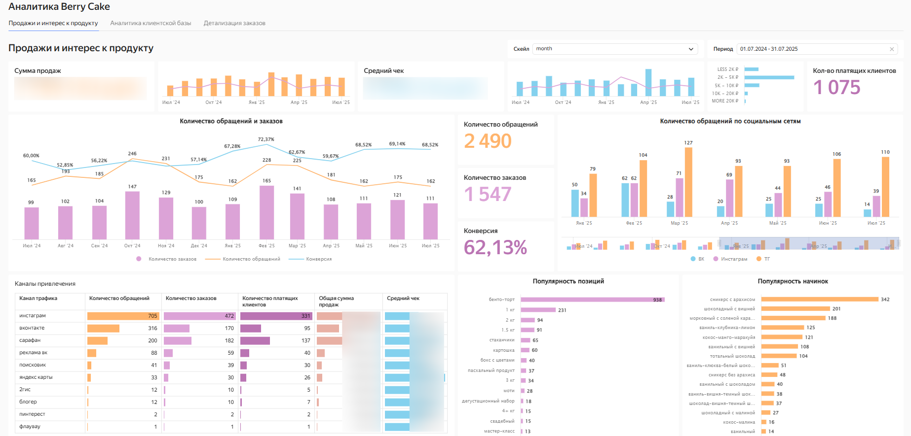
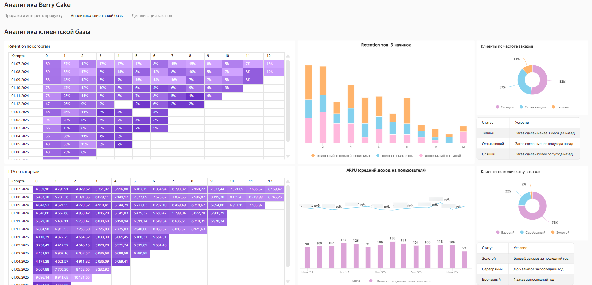
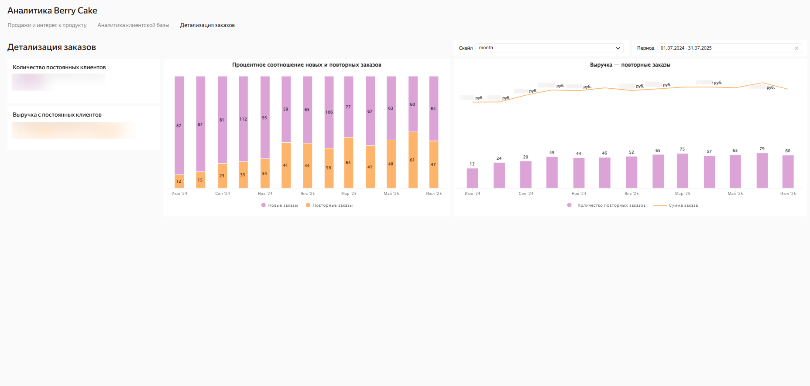
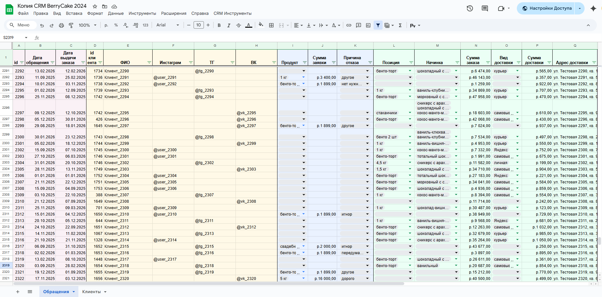
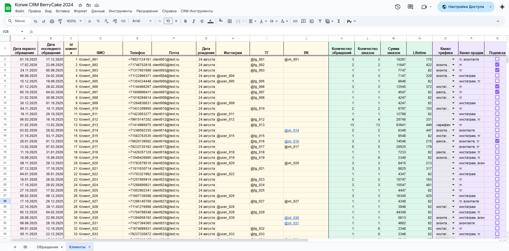

# CRM и аналитика для бизнеса

## 📌 О проекте
В компании отсутствовала централизованная аналитика: отчёты формировались точечно, по запросу, бизнесу не хватало системности и понимания, что эта системность нужна и важна.
Я взяла на себя инициативу и выстроила аналитику с нуля: разработала CRM-систему и создала интерактивный дашборд в DataLens.  

#### Пример дашборда
Это основной скриншот проекта, в [*конце файла (кликабельно)*](#СКРИНШОТЫ-ПРОЕКТА) можно ознакомиться со всеми скриншотами дашборда и CRM

  

---

## Что сделано

- Разработана и автоматизирована CRM-система с нуля
- Определены и настроены ключевые метрики для бизнеса  
- Создан дашборд в DataLens, который стал основным инструментом для принятия решений  
- Данные стали доступными и наглядными для руководства, в связи с чем бизнес перестал действовать интуитивно

---

## Стек

- **CRM**: разработка на JavaScript (код был сгенерирован нейросетью, затем оптимизировался вручную)  
- **BI-инструменты**: DataLens
- **Таблицы**: Google Sheets (сбор и подготовка данных)

---

## Результат

- Руководство стало принимать решения на основе данных, а не действовать "на ощупь" и следуя интуиции 
- Создан интерактивный дашборд в DataLens, что сократило время на подготовку отчётов и автоматизировало их формирование
- Сократилось время работы менеджеров в **3 раза** благодаря автоматизации CRM, а также минимизированы ошибки в её заполнении
- Сократились потери лидов на **11%**
- Выручка выросла за счёт внедрения аналитики и продуктовых экспериментов

---

## СКРИНШОТЫ ПРОЕКТА

### Дашборд в DataLens
###### Дашборд — продажи и интерес к продукту
  

###### Дашборд — аналитика клиентской базы
  

###### Дашборд — детализация заказов
  

### CRM в Google Sheets (данные замаскированы)

###### CRM — лист "Обращения"
  

###### CRM — лист "Клиенты"
  
